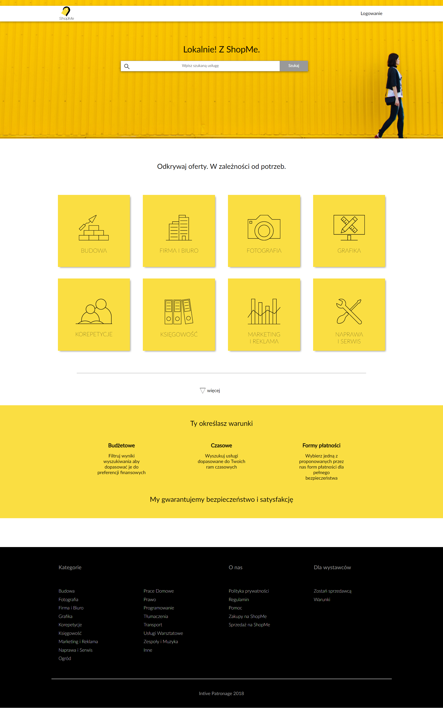
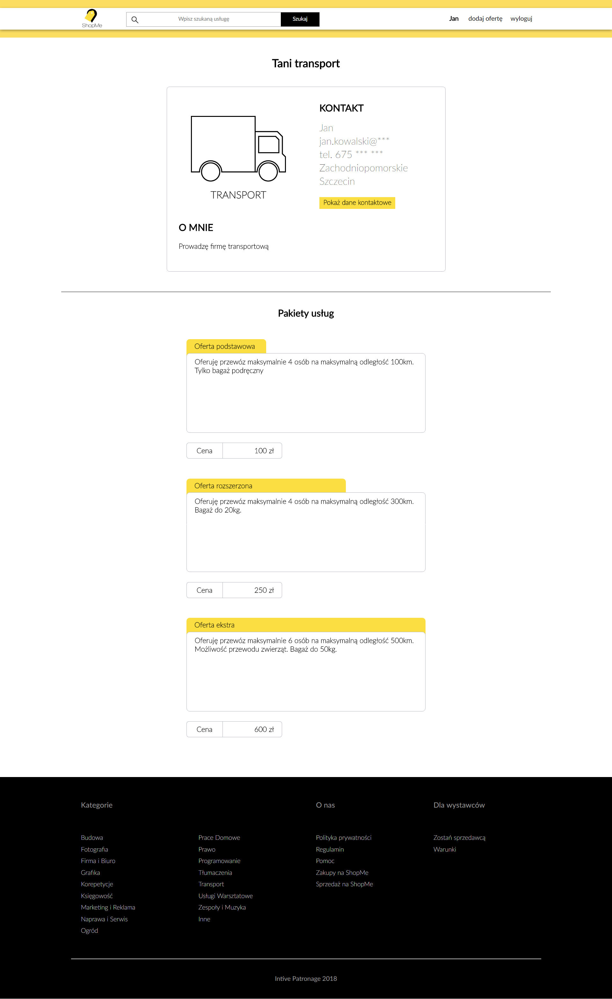
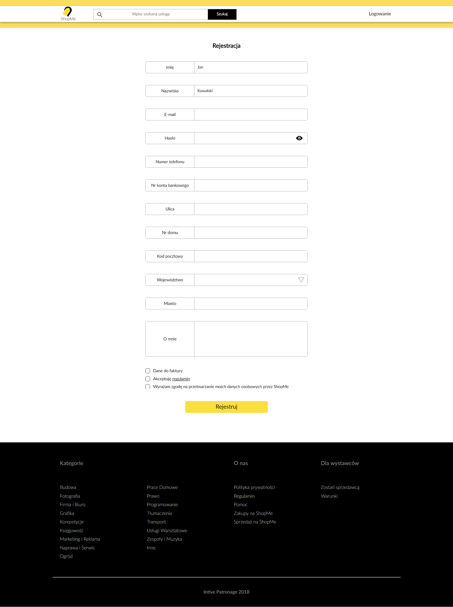

# ShopeME Front-end

- [Description](#description)
- [Quickstart](#quickstart)
- [Requirements](#requirements)
- [Technological stack](#Technological-stack)
- [Project structure](#project-structure)
- [Scripts](#scripts)
- [App preview](#app-preview)

## Description

ShopMe is a web application that allows you to add offers for various types of services. 


## Quickstart

Once: `yarn install`

Development version: `yarn run server` and `yarn run client:dev`

Production version: `yarn run client:prod`

App adress:

- [http://localhost:3000](http://localhost:3000) front-end application

## Requirements

- [Node.js](https://nodejs.org)
- [Yarn](https://yarnpkg.com)


## Technological stack 

- [Create React App](https://github.com/facebookincubator/create-react-app)
- [React Router V4](https://github.com/ReactTraining/react-router)
- [react-i18next](https://github.com/i18next/react-i18next)


## Configuration files

- [.editorconfig](http://editorconfig.org)
- [.env](https://github.com/facebook/create-react-app/blob/master/packages/react-scripts/template/README.md#adding-development-environment-variables-in-env)
- [.eslintrc](https://eslint.org)
- [jsconfig.json](https://code.visualstudio.com/docs/languages/jsconfig)


## Project structure

The structure of the project was based on the idea presented on(https://hackernoon.com/structuring-projects-and-naming-components-in-react-1261b6e18d76)

```
shop-me-frontend/
  docs/
  public/
    locales/
      <language>/
        translations.json
    index.html
  src/
    components
      <component name>
        <subcomponent name>
          <subcomponent>.css
          <subcomponent>.jsx
          <subcomponent>.test.jsx
      UI
        <UI element name>
          <UI element>.css
          <UI element>.jsx
          <UI element>.test.jsx
    core
      App.jsx
      i18n.js
      Router.jsx
    screens
      <screen name>
        <screen>.jsx
        <screen>.test.jsx
    index.js
    setupTests.js
  swagger/
    <specification>.<yaml|json>
  package.json
  README.md
```

`docs/` additional, more detailed documentation of individual modules

`public/locales` contains subdirectories corresponding to supported application languages. Translations are stored in files `translations.json` whose structure corresponds to the structure of the application.

`src/components` in the catalogs corresponding to the modules or functionalities of the application, their components are stored. The components are named relatively to the components or UI directory, eg src / components / UI / ExampleTitle / ExampleTitle.jsx will be called ExampleTitle, and src / components / Examples / IPAddress / IPAddress.jsx ExamplesIPAddress

`src/components/UI` it holds generic components used by screen components as well as screens themselves. UI components should never load components outside of the UI directory.

`src/screens` keeps screens according to the routing path, eg / examples / hello will be found in src / screens / Examples / Hello

`src/core/App.jsx` main component

`src/core/i18n.js` i18next-react configuration

`src/core/Router.jsx` configuration / routing component

`*.test.jsx` it is a test of both components and screens


## Scripts

In the project directory, you can run:

### `yarn run client:prod`

Starts the client application with access to the production server

### `yarn run client:dev`

Starts the client application. Requires setting the REACT_APP_API environment variable

### `yarn test`

Runs unit tests

### `yarn coverage`

Runs unit tests and shows the code coverage table with tests

### `yarn run build`

Creates a production build in the `build` directory

### `yarn storybook`

Starts the storybook server

### `yarn eslint`

Starts the eslint for .js and .jsx files


## App preview

 

 
